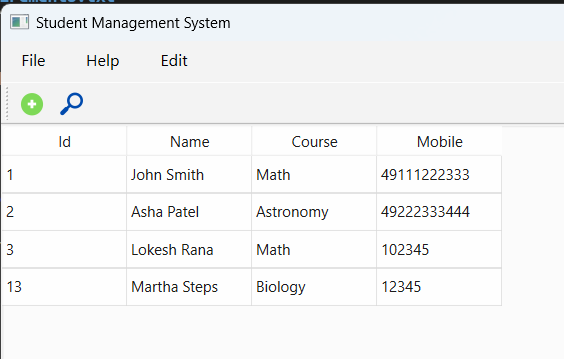

# 🧑‍🎓 Student Management System (PyQt6 + SQLite)

A desktop-based Student Management System built with **Python**, **PyQt6**, and **SQLite3**. It allows users to manage student records via an interactive GUI.

---

## 🚀 Features

- Add new students
- Update student information
- Delete students
- View all student records in a table
- PyQt6-based GUI
- SQLite database for local storage

---

## 🛠️ Tech Stack

- Python 3
- PyQt6
- SQLite3

---

## 📦 Installation

### 1. Clone the Repository

```bash
git clone https://github.com/your-username/student-management-system-using-sqlite.git
cd student-management-system
```

### 2. Create a Virtual Environment (Recommended)

```bash
python -m venv venv
# Activate on Windows
venv\Scripts\activate
# Activate on macOS/Linux
source venv/bin/activate
```

### 3. Install Dependencies

```bash
pip install -r requirements.txt
```

### 4. Run the Application

```bash
python main.py
```

---

## 🗃️ Database

The SQLite database (`students.db`) is created automatically when you run the app. It contains a `students` table with the following schema:

| Column | Type    | Description          |
|--------|---------|----------------------|
| id     | INTEGER | Primary Key (auto)   |
| name   | TEXT    | Student’s full name  |
| age    | INTEGER | Student’s age        |
| course | TEXT    | Enrolled course name |

---

## 📄 requirements.txt

```txt
PyQt6
```

Install using:

```bash
pip install -r requirements.txt
```

---

## 📸 Screenshots



